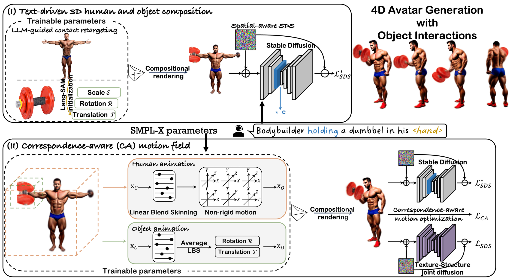

<div align="center">

# AvatarGO: Zero-shot 4D Human-Object Interaction Generation and Animation
  
<a href="https://yukangcao.github.io/">Yukang Cao</a>,
<a href="https://scholar.google.com/citations?user=lSDISOcAAAAJ&hl=zh-CN">Liang Pan</a><sup>†</sup>,
<a href="https://scholar.google.com/citations?user=lSDISOcAAAAJ&hl=zh-CN">Kai Han</a>,
<a href="https://scholar.google.com/citations?user=lSDISOcAAAAJ&hl=zh-CN">Kwan-Yee K. Wong</a>,
<a href="https://liuziwei7.github.io/">Ziwei Liu</a><sup>†</sup>


[](https://arxiv.org/abs/2410.07164)
<a href="https://yukangcao.github.io/AvatarGO/"></a>


  
Please refer to our webpage for more visualizations.
</div>

## Abstract
Recent advancements in diffusion models have led to significant improvements in the generation and animation of 4D full-body human-object interactions (HOI). Nevertheless, existing methods primarily focus on SMPL-based motion generation, which is limited by the scarcity of realistic large-scale interaction data. This constraint affects their ability to create everyday HOI scenes. This paper addresses this challenge using a zero-shot approach with a pre-trained diffusion model. Despite this potential, achieving our goals is difficult due to the diffusion model's lack of understanding of ''where'' and ''how'' objects interact with the human body. To tackle these issues, we introduce AvatarGO, a novel framework designed to generate animatable 4D HOI scenes directly from textual inputs. Specifically, 1) for the ''where'' challenge, we propose LLM-guided contact retargeting, which employs Lang-SAM to identify the contact body part from text prompts, ensuring precise representation of human-object spatial relations. 2) For the ''how'' challenge, we introduce correspondence-aware motion optimization that constructs motion fields for both human and object models using the linear blend skinning function from SMPL-X. Our framework not only generates coherent compositional motions, but also exhibits greater robustness in handling penetration issues. Extensive experiments with existing methods validate AvatarGO's superior generation and animation capabilities on a variety of human-object pairs and diverse poses. As the first attempt to synthesize 4D avatars with object interactions, we hope AvatarGO could open new doors for human-centric 4D content creation.

## Pipeline
AvatarGO takes the text prompts as input to generate 4D avatars with object interactions. At the core of our network are: 1) Text-driven 3D human and object composition that employs large language models to retarget the contact areas from texts and spatialaware SDS to composite the 3D models. 2) Correspondence-aware motion optimization which jointly optimizes the animation for humans and objects. It effectively maintains the spatial correspondence during animation, addressing the penetration issues.


## Install
```bash
# python 3.8 cuda 11.8 pytorch 2.2.1 xformers 0.0.25
conda create -n avatargo python=3.9 -y && conda activate avatargo
conda install -c "nvidia/label/cuda-11.8.0" cuda-toolkit

pip install torch==2.2.1 torchvision==0.17.1 torchaudio==2.2.1 --index-url https://download.pytorch.org/whl/cu118
pip install xformers==0.0.25 --no-deps --index-url https://download.pytorch.org/whl/cu118

# other dependencies
pip install -r requirements.txt

# a modified gaussian splatting (+ depth, alpha rendering)
git clone --recursive https://github.com/ashawkey/diff-gaussian-rasterization
pip install ./diff-gaussian-rasterization

# simple-knn
pip install ./simple-knn

# for mesh extraction
pip install git+https://github.com/NVlabs/nvdiffrast/

```

## SMPL-based preparation
Please follow the instruction from [ICON](https://github.com/YuliangXiu/ICON) to download the SMPL-based model, and put them under the folder ''data''. The folder structure should look like:
```
AvatarGO/
├── data/
    ├── smpl_related/
        ├── models/
            ├── smplx/
                ├── ...
            ├── smpl/
                ├── ...
```


## Obtaining the 3D human and object meshes separately

##### (Optional) Users can give their own 3D human and object meshes. Here, we use [DreamGaussian](https://github.com/dreamgaussian/dreamgaussian) as an example
```bash
python static_gen/process.py /PATH/TO/HUMAN_IMAGE
python static_gen/process.py /PATH/TO/OBJECT_IMAGE

python static_gen/gen.py --config configs/image.yaml input=/PATH/TO/HUMAN_IMAGE_rgba.png save_path=static_human
python static_gen/gen.py --config configs/image.yaml input=/PATH/TO/OBJECT_IMAGE_rgba.png save_path=static_object
```

## Running 3D composition
##### Installation
```bash
# install point-e
git clone https://github.com/openai/point-e.git && cd ./point-e
pip install -e .
cd ..

# re-install the suitable module for composition
pip install ./composite/gaussiansplatting/submodules/simple-knn
pip install ./composite/gaussiansplatting/submodules/diff-gaussian-rasterization

# install lang-sam 1.0 version
git clone https://github.com/paulguerrero/lang-sam.git && cd lang-sam
pip install -e .
cd ..
```

##### Running
```bash
python3 ./composite/main.py --config ./configs/stage2.yaml load_human=/PATH/TO/HUMAN/PLY load_item=/PATH/TO/OBJECT/PLY prompt={human prompt} combine_prompt={combined prompt} position={human part} attention_word={contact word} save_path='composite'

# For example
python3 ./composite/main.py --config ./configs/stage2.yaml load_human=/PATH/TO/HUMAN/PLY load_item=/PATH/TO/OBJECT/PLY prompt='Iron Man' combine_prompt='Iron Man holding an axe in his hand' position='hand' attention_word='holding' save_path='composite'
```

## Running 4D animation
This part of code will be released soon.


## Acknowledgement
Our method is built upon the great work from [GaussianEditor](https://github.com/buaacyw/GaussianEditor), [DreamGaussian](https://github.com/dreamgaussian/dreamgaussian), [DreamGaussian4D](https://github.com/jiawei-ren/dreamgaussian4d). [threestudio](https://github.com/threestudio-project/threestudio), [3D Gaussian Splatting](https://github.com/graphdeco-inria/gaussian-splatting). Thanks a lot to all the authors for sharing

## Misc.
If you want to cite our work, please use the following bib entry:
```
@article{cao2024avatargo,
  title={AvatarGO: Zero-shot 4D Human-Object Interaction Generation and Animation},
  author={Cao, Yukang and Pan, Liang and Han, Kai and Wong, Kwan-Yee~K. and Liu, Ziwei},
  journal={arXiv preprint arXiv:2410.07164},
  year={2024}
}
```
